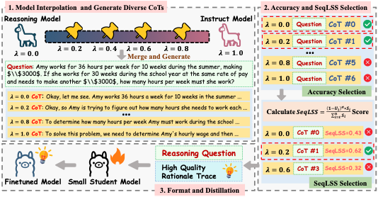

# MI-Distillation: Selecting from Model-Interpolated Instruct-Reasoning Data Spectrum for Chain-of-Thought Distillation

[](https://arxiv.org/abs/2608.29623)
[](LICENSE)

Official implementation of **MI-Distillation: Selecting from Model-Interpolated Instruct-Reasoning Data Spectrum for Chain-of-Thought Distillation** (EMNLP 2026 Findings).

Distilling Long chain-of-thought (CoT) traces from large reasoning models into small students often helps less than concise Short CoT. Effective distillation has to balance the *information density* of a rationale against its *learnability* for the student. MI-Distillation does this in two steps:

1. **Model interpolation** builds a continuous Instruct-Reasoning teacher spectrum by linearly interpolating a reasoning-oriented and an instruction-oriented teacher, producing CoT trajectories that vary smoothly in length, depth and correctness.
2. **SeqLSS** (Sequential Learnable Surprisal Score) selects, per problem, the trajectory that is simultaneously informative and inside the student's high-probability region.



The three stages above map directly onto the pipeline scripts:

| Stage in the figure | Scripts |
| --- | --- |
| 1. Model interpolation and diverse CoT generation | `01_interpolate_teachers.sh`, `02_generate_cot.sh` |
| 2. Accuracy and SeqLSS selection | `04_seqlss_select.sh` |
| 3. Format and distillation | `05_train_sft.sh` |

This repository contains the method and its evaluation harness. The baseline implementations and the plotting code used to produce the paper's figures and tables are not included.

---

## Method

**Teacher interpolation** (Eq. 3). With `Θ_Thi` the reasoning teacher and `Θ_Ins` the instruct teacher:

```
Θ_MI(λ) = λ · Θ_Ins + (1 − λ) · Θ_Thi ,    λ ∈ [0, 1]
```

`λ = 1.0` is the pure Instruct teacher (Short CoT), `λ = 0.0` the pure Reasoning teacher (Long CoT). This is equivalent to task arithmetic over the reasoning and instruction task vectors (Eq. 4).

**SeqLSS** (Eq. 7–10). For a candidate rationale `R = (r_1, ..., r_T)` scored under the student `θ_s`:

```
S_i    = −log p_θs(r_i | x, r_<i)                                  surprisal (informativeness)
U_i    = Σ_{v : p_θs(v) > p_θs(r_i)} p_θs(v | x, r_<i)             mass on higher-ranked tokens
LSS_i  = S_i · (1 − U_i)^α                                          learnability-penalised surprisal
SeqLSS = Σ_i LSS_i / Σ_i S_i
```

`SeqLSS ∈ [0, 1]` estimates the fraction of the informative reasoning signal in `R` that falls inside the student's learnable region. The exponent `α ≥ 0` controls the penalty strength; `α = 4` is the default (Appendix D.5). Normalising by `Σ_i S_i` rather than averaging `LSS_i` prevents a few extreme-surprisal tokens from dominating the sequence score.

### Notation

The paper and the code use the same symbols:

| Paper | Code | Meaning |
| --- | --- | --- |
| `λ` | `--lam` (`src/interpolate_models.py`), `LAMBDAS` | Interpolation coefficient; weight on the **Instruct** endpoint |
| `α` | `--alpha` (`src/seqlss_selection.py`), `ALPHA` | Learnability penalty exponent in Eq. (9) |

Earlier internal versions used `alpha` for the interpolation coefficient and `gamma` for the learnability penalty. `--alpha` accepts `--lss_gamma` and `--lam` accepts `--alpha` as deprecated aliases so old command lines keep working, but new code should use the paper's names.

---

## Repository layout

```
configs/
  deepspeed/                  ZeRO-3 configs (offload = paper setting)
  sft/                        LLaMA-Factory SFT configs for the two students
src/
  interpolate_models.py       Eq. (3): build an interpolated teacher
  generate_cot.py             Sample the candidate pool D with vLLM
  filter_dataset.py           Per-λ correctness + length filtering
  seqlss_selection.py         Eq. (7)-(10): SeqLSS scoring and selection
  export_llamafactory.py      Convert to LLaMA-Factory format and register
evaluation/
  evaluate.py                 vLLM evaluation across 8 benchmarks
  data_processing/, eval/     Answer extraction and math grading
scripts/
  common.sh                   Shared defaults for the pipeline
  01..06_*.sh                 Numbered pipeline stages
  download_assets.py          Fetch models and benchmarks
```

`evaluation/data_processing` and `evaluation/eval` are not only used at evaluation time: `src/seqlss_selection.py` and `src/filter_dataset.py` import the same grader for the accuracy-selection step, so the answers accepted during data construction and during evaluation are identical.

---

## Setup

```bash
git clone <this-repo> && cd CoT-Distillation
python -m venv .venv && source .venv/bin/activate

# Install PyTorch for your CUDA build first: https://pytorch.org/get-started/locally/
pip install -r requirements.txt

# Training uses LLaMA-Factory, installed separately
git clone https://github.com/hiyouga/LLaMA-Factory
pip install -e "LLaMA-Factory[torch,deepspeed]"
```

Download checkpoints and benchmarks (`HF_TOKEN` is only needed for gated repos such as Llama-3.2):

```bash
python scripts/download_assets.py --list
export HF_TOKEN=...   # optional
python scripts/download_assets.py --group teachers-32b --group students --group benchmarks
```

### Training problems

The distillation corpus is drawn from the **MATH training split with the MATH-500 test problems removed**, so that evaluation stays clean. This is not a single Hub dataset, so it is not covered by `download_assets.py`; prepare it yourself as a parquet file (or a directory of parquet files) with these columns:

| Column | Type | Notes |
| --- | --- | --- |
| `unique_id` | int | Stable key; used for resuming, deduplication and pairing across λ |
| `problem` | str | Problem statement |
| `answer` | str | Ground-truth final answer, used by the correctness filter |
| `level` | str | Optional, retained as metadata |
| `type` | str | Optional, retained as metadata |
| `solution` | str | Optional, retained as metadata |

Point `TRAIN_PROBLEMS` at it (default `data/raw/math_train`). The pipeline samples 7,500 problems from it, matching the paper.

### Hardware

Results in the paper come from nodes with 8× NVIDIA L20 and 8× RTX A5000. Two costs dominate:

- **Interpolation** runs on CPU and needs roughly **130 GB host RAM** to hold two 32B bf16 checkpoints, plus ~65 GB disk per interpolated teacher. With six λ values and endpoints symlinked, budget ~260 GB of disk.
- **Generation** is the bulk of the compute: 6 teachers × 7.5k problems at up to 16k tokens each.

---

## Pipeline

Every stage is a thin wrapper over the Python entry points and is configured by environment variables whose defaults live in `scripts/common.sh`. Run them from the repository root.

### 1. Teacher spectrum and candidate pool

```bash
# λ ∈ {0.0, 0.2, 0.4, 0.6, 0.8, 1.0}; endpoints are symlinked, not copied
bash scripts/01_interpolate_teachers.sh

# One CoT file per λ; resumable
CUDA_VISIBLE_DEVICES=0,1,2,3 bash scripts/02_generate_cot.sh
```

### 2. Training sets

```bash
# Optional: one dataset per fixed λ, including the Short CoT (λ=1.0) and
# Long CoT (λ=0.0) endpoints. Not required by MI-Distillation itself.
TOKENIZER_MODEL=pretrained_model/Qwen2.5-3B-Instruct \
  bash scripts/03_build_fixed_lambda_data.sh

# MI-Distillation. SeqLSS is student-conditioned, so run it once per student.
STUDENT_MODEL=pretrained_model/Qwen2.5-3B-Instruct   bash scripts/04_seqlss_select.sh
STUDENT_MODEL=pretrained_model/Llama-3.2-3B-Instruct bash scripts/04_seqlss_select.sh

# Sweep the learnability penalty instead of using the α=4 default
STUDENT_MODEL=pretrained_model/Qwen2.5-3B-Instruct ALPHAS="1 2 3 4" \
  bash scripts/04_seqlss_select.sh
```

Each run prints the dataset name it registered in `data/train_data/dataset_info.json`, and writes a `*_summary.json` recording how many trajectories were selected from each λ.

### 3. Distillation and evaluation

```bash
STUDENT=qwen3b DATASET=<registered-name> RUN_NAME=qwen3b_seqlss_alpha4 \
  bash scripts/05_train_sft.sh

MODELS="outputs/sft/qwen3b_seqlss_alpha4" bash scripts/06_evaluate.sh
```

`STUDENT` is `qwen3b` or `llama3b`. Training pins the paper's hyperparameters: AdamW, lr 1e-5, 3 epochs, cutoff 8192, effective global batch 32 (1 × 8 grad-accum × 4 GPUs), bf16, DeepSpeed ZeRO-3 offload.

Evaluation follows the paper's protocol: temperature 0.6, top-p 0.95, 8192 new tokens, pass@1 with **16 repeats** on AIME24/AMC23 and **4 repeats** on GSM8K, MATH-500, GPQA-Diamond, Minerva and OlympiadBench.

Each repeat is written to its own file, `outputs/eval/{benchmark}_{model}_run{N}.json`, containing the overall accuracy, any per-group breakdown (MATH-500 difficulty level, OlympiadBench subfield) and every individual prediction.

---

## Using the method on your own models

The pipeline is not tied to the Qwen/QwQ pair:

- **Different teachers.** Set `REASONING_MODEL`, `INSTRUCT_MODEL` and `TEACHER_TAG`. The two endpoints must share an architecture and parameter shapes; interpolating across families will fail the shape check in `src/interpolate_models.py`. Staying inside one family also controls for pretraining differences, which is what makes the spectrum interpretable.
- **Different students.** Add `configs/sft/sft_<name>.yaml` with the matching LLaMA-Factory chat template and extend the `case` block in `scripts/05_train_sft.sh`. Then pass `STUDENT_MODEL=<path>` to stage 4 so SeqLSS scores under the right student.
- **Different λ grid.** Set `LAMBDAS`. More points cost proportionally more generation compute but give SeqLSS a finer spectrum to choose from.
- **Different prompt.** Set `EVAL_INSTRUCTION`. It must stay identical across generation, training and evaluation, which is why all three read it from the same place.

---

## Notes on faithfulness to the paper

- **Generation vs. filtering length.** Trajectories are generated with a 16k-token budget and *then* filtered to prompt + response < 8192 tokens. Generating with headroom avoids counting truncated rationales as incorrect; the training data still respects the 8192 limit reported in the paper.
- **Teacher scales.** The main results use the 32B spectrum (QwQ-32B ↔ Qwen2.5-32B-Instruct). The 14B spectrum (DeepSeek-R1-Distill-Qwen-14B ↔ Qwen2.5-14B-Instruct) is available via `--group teachers-14b` and the `TEACHER_TAG` override.
- **Prompt.** Generation, training and evaluation all use `"{question}\nPlease reason step by step, and put your final answer within \boxed{}."` under the model's own chat template (Table 5).

---

## Citation

The paper is accepted to Findings of EMNLP 2026 but not yet in the ACL Anthology, so please cite the arXiv preprint for now:

```bibtex
@misc{lan2026midistillation,
  title         = {MI-Distillation: Selecting from Model-Interpolated Instruct-Reasoning
                   Data Spectrum for Chain-of-Thought Distillation},
  author        = {Yangsong Lan and Renkai Hu and HongKai Zheng and Bo Zhang and
                   Renzhi Wang and Hongliang Dai and Piji Li},
  year          = {2026},
  eprint        = {2608.29623},
  archivePrefix = {arXiv},
  primaryClass  = {cs.CL},
  url           = {https://arxiv.org/abs/2608.29623}
}
```

## Acknowledgements

Training uses [LLaMA-Factory](https://github.com/hiyouga/LLaMA-Factory); generation and evaluation use [vLLM](https://github.com/vllm-project/vllm). The answer-extraction and math-grading utilities in `evaluation/` follow the DeepSeek-Math evaluation suite.

## License

Released under the MIT License; see [LICENSE](LICENSE).
